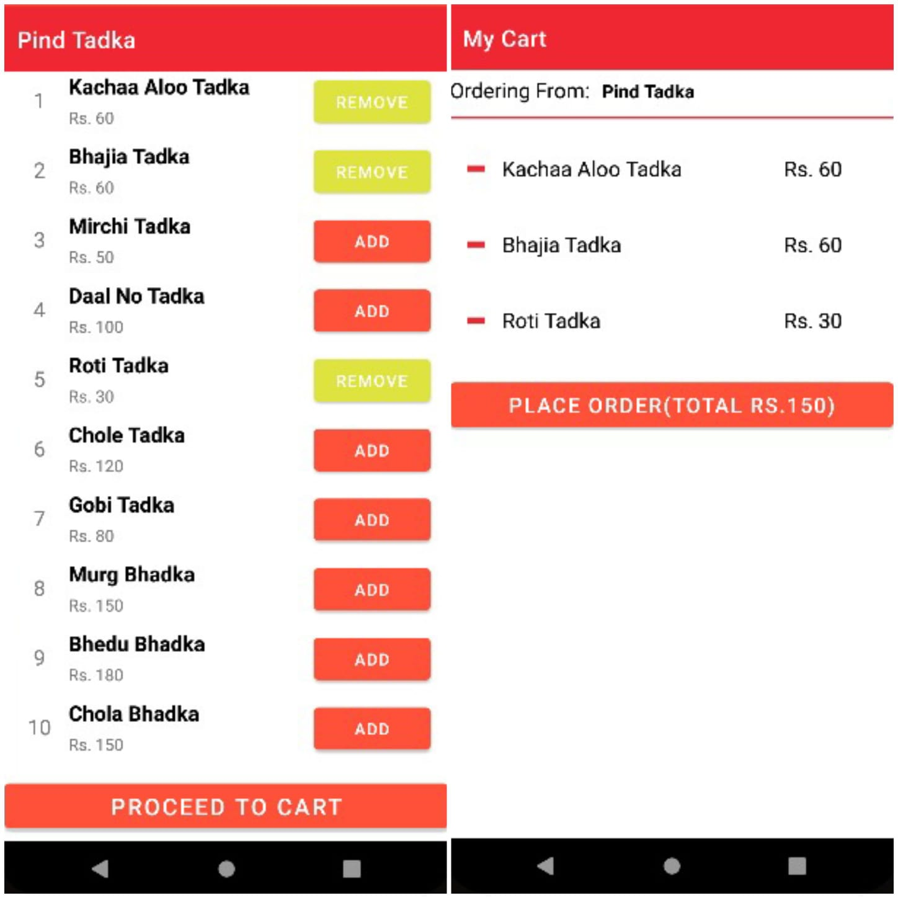

# Food-Runner-App

Food ordering app made with kotlin. With all basic functionalities of registering with phone number, and also forgot password authentication with email.
Also added navigation menu.

Can see all the Restaurant list and can add multiple menu items to the cart and proceed to place the order.

Also contains Favourite Restaurant page, FAQ's page and also logout functionality.

